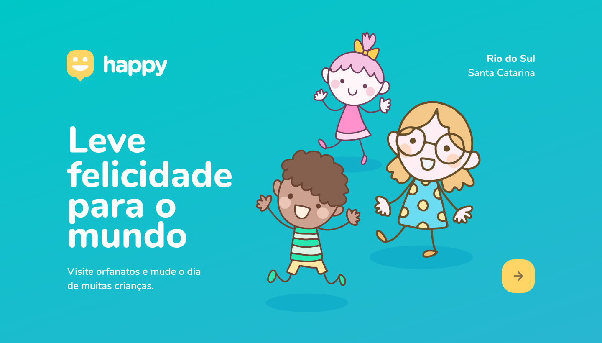

  <a align="right" href="#pt-BR-Readme">pt-BR</a>&nbsp;|&nbsp;
  <a href="#en-US-Readme">en-US</a>
 

<h6 align="right">#pt-BR Readme</h6>
<h1 align="center">
   Happy 😄 - Next Level Week #3  
  #JS|#HTML|#CSS|#NODEJS|#SQL 
</h1>

  
  
   
   

  <a href="#bookmark-sobre">Sobre</a>&nbsp;&nbsp;&nbsp;|&nbsp;&nbsp;&nbsp;
  <a href="#rocket-tecnologias">Tecnologias</a>&nbsp;&nbsp;&nbsp;|&nbsp;&nbsp;&nbsp;
  <a href="#clipboard-notion">Notion</a>&nbsp;&nbsp;&nbsp;|&nbsp;&nbsp;&nbsp;
  <a href="#paintbrush-layout">Layout no Figma</a>

    

## :bookmark: Sobre

**Happy** é uma aplicação Web que permite facilitar o contato entre pessoas e casas de acolhida infantis. Voltado para instituições que prestam apoio às crianças em situações de abandono ou fragilidade social, o Happy é um ambiente pensado para aproximá-las das pessoas que possuem a intenção de contribuir para estes projetos sociais. A aplicação permite que instituições cadastrem o seu serviço para que pessoas possam entrar em contato com elas para contribuir.

Esta aplicação foi elaborada durante a 3ª edição da **Next Level Week**, realizada pela [Rocketseat](https://rocketseat.com.br/), ao longo da trilha **Discovery**, com o professor [Mayk Brito](https://github.com/maykbrito).

## :rocket: Tecnologias

-  [HTML](https://developer.mozilla.org/pt-BR/docs/Web/HTML/)
-  [Handlebars](https://handlebarsjs.com/)
-  [CSS](https://developer.mozilla.org/pt-BR/docs/Web/CSS/)
-  [JavaScript](https://developer.mozilla.org/pt-BR/docs/Web/JavaScript/)
-  [Node.js](https://nodejs.org/en/docs/)
-  [HandlebarsJS](https://handlebarsjs.com/)
-  [SQLite](https://www.sqlite.org/docs.html/)
-  [Express](https://expressjs.com/)

## :clipboard: Notion

- [NLW3 #03](https://www.notion.so/NLW-Discovery-03-628a2c1b9ac744e28fad80046b699aab) 🚀
- [Front-end](https://www.notion.so/Front-end-010548f316d04d65a0d8b72865874ed1) ☕
- [Back-end](https://www.notion.so/Back-end-ff655163e56b4927ae7a7a4e08049e64) 👨‍🍳
- [Database](https://www.notion.so/Banco-de-Dados-ba70111f89924bda94bb1016f12df8c8) 📦

## :paintbrush: Layout

Clique aqui para abrir o layout do projeto no [Figma](https://www.figma.com/file/0o6IOVcmfEhtO4ZJM7xL27/Project-Happy---NLW%233?node-id=0%3A1) feito por [Tiago Luchtenberg](https://www.instagram.com/tiagoluchtenberg/). Não se esqueça! Será necessário ter uma conta no Figma 😉.

README.md baseada no projeto [Proofy](https://github.com/HigorSnt/proffy) de [HigorSnt](https://github.com/HigorSnt).
 Projeto desenvolvido com a tutoria de [Mayk Brito](https://github.com/maykbrito), durante a [**Next Level Week**](https://rocketseat.com.br/) da [**Rocketseat**](https://www.linkedin.com/school/rocketseat/about/)** 💜.

<h6 align="right">#en-US Readme</h6>
<h1 align="center">
   Happy 😄 - Next Level Week #3 
  #JS|#HTML|#CSS|#NODEJS|#SQL
</h1>

  
  
   
   

  <a href="#bookmark-about">About</a>&nbsp;&nbsp;&nbsp;|&nbsp;&nbsp;&nbsp;
  <a href="#rocket-stack">Stack</a>&nbsp;&nbsp;&nbsp;|&nbsp;&nbsp;&nbsp;
  <a href="#clipboard-notion-guide">Notion</a>&nbsp;&nbsp;&nbsp;|&nbsp;&nbsp;&nbsp;
  <a href="#paintbrush-Figma-Layout">Figma Layout</a>

    

## :bookmark: About

**Happy** is a web application that ease contact between people and children's homes. Aims for institutions that provide support to children in situations of abandonment or social fragility, Happy is an environment designed to bring them closer to people intending to contribute to these social projects. The app allows institutions to register their service so one can contact them to support.

This application was developed in the 3rd edition of the **Next Level Week**, event held by [Rocketseat](https://rocketseat.com.br/), along the **Discovery** track, with the professor [Mayk Brito](https://github.com/maykbrito).

## :rocket: Stack

-  [HTML](https://developer.mozilla.org/pt-BR/docs/Web/HTML/)
-  [Handlebars](https://handlebarsjs.com/)
-  [CSS](https://developer.mozilla.org/pt-BR/docs/Web/CSS/)
-  [JavaScript](https://developer.mozilla.org/pt-BR/docs/Web/JavaScript/)
-  [Node.js](https://nodejs.org/en/docs/)
-  [HandlebarsJS](https://handlebarsjs.com/)
-  [SQLite](https://www.sqlite.org/docs.html/)
-  [Express](https://expressjs.com/)

## :clipboard: Notion-Guide

- [NLW3 #03](https://www.notion.so/NLW-Discovery-03-628a2c1b9ac744e28fad80046b699aab) 🚀
- [Front-end](https://www.notion.so/Front-end-010548f316d04d65a0d8b72865874ed1) ☕
- [Back-end](https://www.notion.so/Back-end-ff655163e56b4927ae7a7a4e08049e64) 👨‍🍳
- [Database](https://www.notion.so/Banco-de-Dados-ba70111f89924bda94bb1016f12df8c8) 📦

## :paintbrush: Figma-Layout

Click to open the project's layout with [Figma](https://www.figma.com/file/0o6IOVcmfEhtO4ZJM7xL27/Project-Happy---NLW%233?node-id=0%3A1) made by [Tiago Luchtenberg](https://www.instagram.com/tiagoluchtenberg/). Don't Forget! You'll need a Figma profile 😉.

README.md based on project [Proofy](https://github.com/HigorSnt/proffy), by [HigorSnt](https://github.com/HigorSnt).
 Project developed with the teaching of [Mayk Brito](https://github.com/maykbrito), along [**Next Level Week**](https://rocketseat.com.br/), by [**Rocketseat**](https://www.linkedin.com/school/rocketseat/about/)** 💜.
